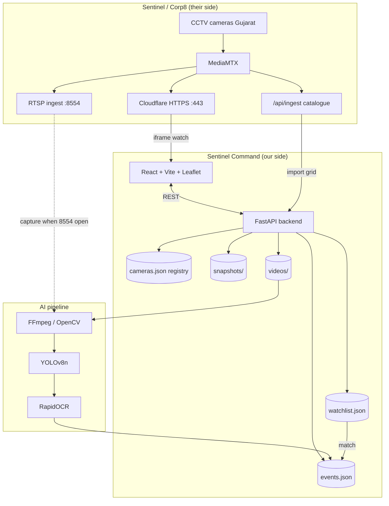

# Sentinel Command — High-Level Design (HLD)

**Project:** Gujarat Police Innovation Challenge 2026 (Sentinel CCTV)  
**Product:** Sentinel Command  
**Scope:** Hybrid **Model 1** (GIS camera registry) + **Model 2** (unified view, ANPR, watchlist, hunt, CSV)  
**Author:** Nikhil (Category 1, solo)

---

## 1. Problem we solve

Gujarat has thousands of CCTV cameras across departments, vendors, and formats. Police need one place to:

1. **Know where cameras are** (GIS registry)  
2. **Watch live feeds** in one UI  
3. **Read number plates** (ANPR)  
4. **Flag stolen / wanted vehicles** and **trace movement** across cameras  
5. **Export evidence** (CSV + snapshots)

Sentinel Command is a thin operational layer on top of the **official Sentinel ingest catalogue** — not a replacement for their MediaMTX / Cloudflare stack.

---

## 2. Alignment with official Sentinel solution

| Official requirement | Our implementation | Status |
|---|---|---|
| **Model 1 — GIS registry** | Import `/api/ingest`, pin cameras on Leaflet map, gap report, registry CSV | Done |
| **Model 2 — Unified viewing** | Dashboard + 4-up wall; embed `cctv.corp8.cloud/camera/{id}` (password session) | Done |
| **Model 2 — ANPR** | YOLOv8n vehicle detect → plate crop → RapidOCR on sampled frames | Done (file + HLS/RTSP when reachable) |
| **Watchlist / alerts** | Stolen plate list; red banner when OCR match | Done |
| **Cross-camera hunt** | `GET /hunt?plate=` → GIS trail + CSV export | Done |
| **Official AI ingest** | Catalogue + RTSP TCP, HLS fallback, cookie login to `cctv.corp8.cloud` | Built; **public :8554 still blocked** |
| **Model 3 / 4** (80k cameras, Kafka, face, VAHAN) | Roadmap slide only — **not running code** | PPT / future |

**Jury test mapping**

| Jury action | How we demo it |
|---|---|
| Onboard cameras | **Fetch Sentinel grid** → 30 official cameras from `GET /api/ingest` |
| Hunt a vehicle number | **Hunt** → map pins + hit list + **Export CSV** |
| GIS trail | Leaflet map highlights cameras where plate was seen |
| Watchlist alert | Add plate → red **STOLEN PLATE** banner + `/alerts` |
| Live government feed | Select Camera 4/5/12 → HTTPS live player (same as portal) |
| ANPR on feed | **Extract → Detect** on MP4 (gate/Paldi clips or screen recording) |

---

## 3. Architecture (BTS)



### 3.1 Data flow — watch (works today)

1. Operator registers at `https://cctv.corp8.cloud/auth/register` and signs in (UI or `SENTINEL_PASSWORD`).  
2. User clicks **Fetch Sentinel grid**.  
3. Backend calls `https://cctv.corp8.cloud/api/ingest` with the session cookie.  
4. Each camera stored with `rtsp_url`, `hls_url`, `preview_url`, department, codec, lat/lng.  
5. UI embeds `https://cctv.corp8.cloud/camera/{id}` (same portal; login required in the browser for the iframe).

### 3.2 Data flow — ANPR (our AI path)

1. **Source:** local MP4, uploaded recording, or RTSP (when port 8554 reachable).  
2. **Extract:** FFmpeg samples ~1 JPEG/sec → `data/snapshots/{camera_id}/`.  
3. **Detect:** YOLOv8n finds car / bus / truck / motorcycle.  
4. **OCR:** Lower 45% of bbox cropped → RapidOCR → normalize plate text.  
5. **Store:** Event row: `plate, camera_id, t_sec, label, snapshot_url, confidence`.  
6. **Watchlist:** On each event, if plate ∈ watchlist → alert.  
7. **Hunt:** Query all events for plate → group by camera → draw GIS trail → CSV.

### 3.3 Why two video paths exist

| Path | Port | Used for | Works from home? |
|---|---|---|---|
| HTTPS portal / HLS | 443 | Human viewing + HLS ANPR fallback | Yes, **after grid password** |
| RTSP TCP | 8554 | Machine ingest (OpenCV) for ANPR | No (timeout on public internet) |

This is an **infrastructure** gap, not missing integration on our side. We consume the exact `rtsp_url` from `/api/ingest` with `rtsp_transport=tcp` and PTS-based sampling per the integrator guide.

---

## 4. Tech stack

| Layer | Technology | Role |
|---|---|---|
| **Frontend** | React 19, Vite 6 | Single-page command UI |
| **Map** | Leaflet, react-leaflet, OpenStreetMap | Model 1 GIS pins + hunt trail |
| **API** | FastAPI, Uvicorn | REST endpoints, static media |
| **Config** | pydantic-settings, `.env` | Paths, ingest URLs |
| **Registry / events** | JSON files (`data/*.json`) | Solo-speed persistence (SQLite/PostGIS = future) |
| **Video decode** | FFmpeg (imageio-ffmpeg), OpenCV | Frame extract; RTSP when available |
| **Object detection** | Ultralytics YOLOv8n | Vehicles in frame |
| **Plate OCR** | RapidOCR (ONNX) | Read plate text from crop |
| **Official feeds** | `/api/ingest`, MediaMTX URLs | Catalogue + live URLs |
| **Dev runtime** | Python 3.12 venv, Node.js | Local jury demo |

**Explicitly out of scope (hackathon):** Kafka, Kubernetes, face recognition, live VAHAN, Model 3/4 runtime.

---

## 5. Component map (backend)

| Module | Responsibility |
|---|---|
| `main.py` | REST API, CORS, media mounts |
| `sentinel.py` | Fetch `/api/ingest`, map to `sentinel-{id}` cameras |
| `store.py` | Camera registry CRUD, GIS enrich, CSV import |
| `ingest.py` | FFmpeg frame extract from file |
| `live_capture.py` | RTSP TCP capture, PTS sampling, backoff |
| `detect.py` | YOLO + OCR → annotated JPEGs |
| `events.py` | Append / list detection events |
| `watchlist.py` | Stolen / wanted plates |
| `alerts.py` | Watchlist ∩ events |
| `plates.py` | Plate normalization (`GJ01AB1234`) |

---

## 6. Key API endpoints

| Method | Path | Purpose |
|---|---|---|
| GET | `/health` | Service + camera counts |
| GET | `/cameras` | Full registry with map metadata |
| GET | `/cameras/gap` | Model 1 coverage / gap report |
| GET | `/cameras.csv` | Registry export |
| POST | `/cameras/sentinel/import` | Pull official grid from `/api/ingest` |
| POST | `/sentinel/login` | Session cookie for `cctv.corp8.cloud` |
| POST | `/cameras/{id}/extract` | Sample frames (file, RTSP TCP, or HLS) |
| POST | `/cameras/{id}/analyze` | Run YOLO + OCR |
| GET | `/events?camera_id=` | Per-camera detections |
| POST | `/watchlist` | Add stolen plate |
| GET | `/alerts` | Active watchlist hits |
| GET | `/hunt?plate=` | Cross-camera trail (JSON) |
| GET | `/hunt.csv?plate=` | Jury CSV export |

---

## 7. Camera object model

```json
{
  "id": "sentinel-5",
  "name": "Camera 5",
  "location": "05 Visat teen Rasta",
  "city": "Ahmedabad",
  "lat": 23.07,
  "lng": 72.57,
  "source_type": "rtsp",
  "source_url": "rtsp://live.corp8.cloud:8554/stream/5",
  "hls_url": "https://cctv.corp8.cloud/live/stream/5/index.m3u8",
  "preview_url": "https://cctv.corp8.cloud/camera/5",
  "department": "Home / Police (sandbox)",
  "remote_id": "5",
  "live": true
}
```

File cameras (ANPR demo clips, screen recordings) use `source_type: "file"` and a path under `data/videos/`.

---

## 8. Deployment view (jury laptop)

```
┌─────────────────────────────────────────────┐
│  Browser  http://localhost:5173             │
│  (React UI — map, hunt, live iframe)        │
└──────────────────┬──────────────────────────┘
                   │ proxy / REST
┌──────────────────▼──────────────────────────┐
│  FastAPI  http://127.0.0.1:8000             │
│  + YOLO + OCR + JSON store                  │
└──────────────────┬──────────────────────────┘
                   │
     ┌─────────────┼─────────────┐
     ▼             ▼             ▼
 data/videos   data/snapshots   cctv.corp8.cloud
 (MP4)         (JPEG evidence)  (watch + HLS, password)
```

---

## 9. Scale path (80k roadmap — slide only)

| Phase | Change |
|---|---|
| **Now (hackathon)** | JSON store, single node, 30–40 cameras, file + official catalogue |
| **Phase 2** | PostgreSQL + PostGIS, Redis watchlist, object storage for snapshots |
| **Phase 3** | RTSP ingest workers per zone, queue (Kafka/RabbitMQ), horizontal API |
| **Phase 4** | VAHAN lookup, face / behaviour analytics (Model 3/4) |

---

## 10. Known limitation (honest for judges)

- **Grid HTTP is password-gated** at `cctv.corp8.cloud`. Without `SENTINEL_PASSWORD`, Fetch Grid and HLS ANPR cannot refresh the live catalogue (cached 30-camera JSON still maps).  
- **Live ANPR on government RTSP** requires TCP **8554** reachable. From public internet it times out. Integrator fallback is HLS on 443.  
- **Workaround for demo:** own MP4s (Gate/Paldi/Visat) use the same Extract/Detect/Hunt pipeline.  
- **Production fix:** event network opens 8554, or Spectrum / direct MediaMTX for integrators.

---

## 12. Diagram exports (PPT / jury pack)

Static files for PowerPoint — open SVG directly or insert PNG:

| Diagram | SVG | PNG |
|---|---|---|
| System architecture | [docs/diagrams/sentinel-architecture.svg](docs/diagrams/sentinel-architecture.svg) | [docs/diagrams/sentinel-architecture.png](docs/diagrams/sentinel-architecture.png) |
| Hunt & watchlist flow | [docs/diagrams/hunt-watchlist-flow.svg](docs/diagrams/hunt-watchlist-flow.svg) | [docs/diagrams/hunt-watchlist-flow.png](docs/diagrams/hunt-watchlist-flow.png) |

Interactive canvases (open beside chat in Cursor):

- Architecture: `canvases/sentinel-hld-architecture.canvas.tsx`
- Hunt & watchlist: `canvases/hunt-watchlist-flow.canvas.tsx`

---

## 11. One-line pitch

> **Sentinel Command** unifies Gujarat’s Sentinel camera catalogue on a GIS map, plays live feeds in one dashboard, runs ANPR with watchlist alerts, and produces cross-camera hunt trails with CSV export — built to the official `/api/ingest`, RTSP-TCP, and HLS fallback spec on `cctv.corp8.cloud`.

---
